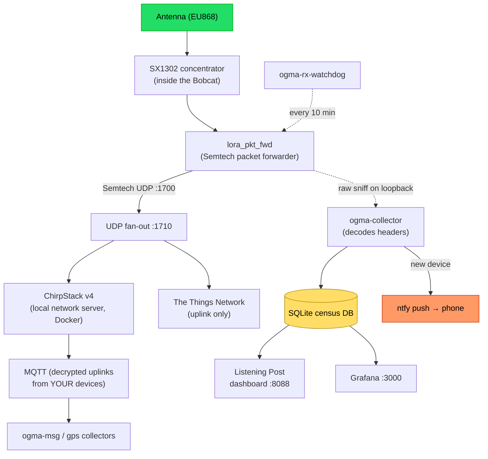

# OgmaOS — Bobcat LoRaWAN EU868Mhz Listening Post

**Turn a dead Bobcat Helium miner into a self‑hosted EU868 LoRaWAN gateway and a "listening post" that quietly maps the LoRaWAN devices broadcasting around you** — with live dashboards, device fingerprinting, The Things Network forwarding, and phone alerts. All private, all on your own hardware.

> **Read this first — it can be one‑way.** On the **eMMC models (G290 / G295, the "29X")** installing this **erases the Bobcat's original Helium software** and generally can't be undone; the **SD‑boot models (G280 / G285)** run from the card and are reversible. Full explanation: **[Warning: this wipes the original Bobcat software](#warning-this-wipes-the-original-bobcat-software)**.


---

## Contents

- [Warning: this wipes the original Bobcat software](#warning-this-wipes-the-original-bobcat-software)
- [What is this? (start here if you're new)](#what-is-this-start-here-if-youre-new)
- [What it does](#what-it-does)
- [The proven build (what actually worked)](#the-proven-build-what-actually-worked)
- [How it works](#how-it-works)
- [Hardware you need](#hardware-you-need)
- [The two fixes that make a repurposed Bobcat actually receive](#the-two-fixes-that-make-a-repurposed-bobcat-actually-receive)
- [Install guide](#install-guide-copy-paste)
- [The services](#the-services-reference)
- [Dashboards & remote access](#dashboards--remote-access)
- [Phone alerts](#phone-alerts)
- [Troubleshooting](#troubleshooting)
- [Security & privacy](#security--privacy)
- [Credits & licence](#credits--licence)

---

## Warning: this wipes the original Bobcat software

**Whether this erases the stock software depends on your Bobcat model** — and on the eMMC models it is effectively permanent, so understand it before you start:

- **G290 / G295 (the "29X", eMMC flasher):** installing Armbian **overwrites the internal eMMC**, erasing the original Helium miner OS and firmware. Bobcat's stock firmware is not publicly downloadable, so you generally **cannot restore it to being a miner** — treat this as **one‑way / permanent**.
- **G280 / G285 (SD boot):** these run entirely from the SD card and **leave the stock eMMC untouched** — pop the SD out and you are back to stock. **Reversible.**
- **Only flash a unit you've decided to repurpose** — a dead, decommissioned, or no‑longer‑mining Bobcat. Don't overwrite one you still want to mine with.
- **The trade:** you lose the Helium mining function (on the eMMC models); you gain a fully open Linux computer running a working LoRaWAN gateway and listening post.

If the miner is already dead weight and that's fine by you, carry on to the [install guide](#install-guide-copy-paste).

---

## What is this? (start here if you're new)

A few plain‑English definitions first:

- **LoRaWAN** is a long‑range, low‑power radio standard used by *Internet‑of‑Things* sensors — temperature/CO₂ sensors, water meters, asset trackers, parking sensors. They whisper tiny messages that travel several kilometres on a coin‑cell battery. In Europe they use the **EU868** band (~868 MHz).
- A **gateway** is the radio receiver that listens for those messages and passes them on. Think of it as a cell tower, but for tiny sensors.
- A **Bobcat** is a small computer (a Rockchip **RK3566** board) originally sold as a **Helium** crypto‑miner. Many now sit dead in drawers — but inside is a genuine, high‑quality LoRaWAN radio (a Semtech **SX1302** concentrator) going to waste.

**This project repurposes that dead Bobcat into a working LoRaWAN gateway**, then adds a "**listening post**" layer: it logs every LoRaWAN frame it hears, guesses each device's maker, plots coverage on a map, and can forward traffic to **The Things Network**. Point a small antenna out of a window and it shows you the invisible IoT world around you.

**Is that legal / creepy?** You're a **passive receiver**. You can see a device's presence and signal, but payloads are **AES‑encrypted** — you can't read other people's data, and you never transmit for them. You only decrypt **your own** devices. It's the radio equivalent of noting that Wi‑Fi networks exist nearby.

---

## What it does

- **Receives real EU868 LoRaWAN** via the Bobcat's SX1302 concentrator.
- **Census database** — every frame logged to SQLite (device ID, RSSI, SNR, frequency, spreading factor, timing).
- **Device fingerprinting** — guesses the maker (Elsys, Milesight, Dragino, Adeunis, Browan…) from the OUI + traffic signature.
- **Listening Post dashboard** — live map, coverage rings, device table, signal analytics.
- **Grafana** — frames/hour, new devices/day, makers over time.
- **The Things Network forwarding** — optionally relay uplinks to TTN (uplink‑only; downlink authority stays local).
- **Phone alerts** — a push the first time a new device appears.
- **Private remote access** — every dashboard over Tailscale HTTPS, never exposed publicly.
- **Self‑healing watchdog** — detects an RX stall and tells you exactly how to fix it.

---

## The proven build (what actually worked)

This is the **real, tested sequence** that got a dead Bobcat 29X receiving live LoRaWAN — confirmed on hardware, not theory. Full commands are in the [Install guide](#install-guide-copy-paste) below; this is the map and the traps.

1. **Flash Armbian to the eMMC** (via sicXnull's SD flasher image — burn it to an SD card, boot, and it auto-writes the eMMC). Result: a Debian/Armbian box you can SSH into.
2. **Build `sx1302_hal` (v2.1.0)** with the **stock EU868** config. On the 29X the concentrator is on **`/dev/spidev5.0`** (the SX1261 companion on `spidev5.1` is unused). Leave **`full_duplex: false`** — setting it `true` hard-fails the concentrator on this SX1302 + SX1250 board.
3. **Fix #1 — power the RF rail (device tree).** The `lora-3v3-regulator`'s `vin-supply` was mis-pointed at a pinctrl node, so it never probed (`-517`) and the RF section stayed dark. Repoint it to `vcc3v3_sys` and reboot. Verify `lora_3v3` then reads **enabled @ 3.3 V**. **Skip this and you get 0 packets, forever.**
4. **Fix #2 — enable the front-end amp (GPIO147).** Drive **GPIO147 HIGH** and pulse the **GPIO149** reset *before* `lora_pkt_fwd` starts (the `ExecStartPre` script does this). It switches on the receive front-end that generic HAL leaves off. **Skip this and you also get 0 packets.**
5. **Start the gateway — then WAIT.** Real ambient LoRaWAN is **minutes-to-hours apart**, so a short test shows nothing even when everything is right. **Watch for 20+ minutes** (the first real packet here only landed on an overnight watch). **Judging it "dead" too early is the single biggest trap in this whole build.**
6. **Confirmed receiving:** valid `CRC_OK` uplinks from real neighbours (an Elsys ERS-CO2 at about −118 dBm), gateway shown online in ChirpStack.
7. **Then layer on the stack:** local **ChirpStack** (Docker) → **collector** (SQLite census + ntfy new-device alerts) → **Listening Post** + **Grafana** dashboards → optional **TTN** fan-out → **Tailscale** HTTPS remote access → the **RX watchdog**.

**The one operational scar to know about:** after ~2 days, RX can suddenly go silent again (a latched concentrator state). A `restart`, a full `reboot`, and even toggling the FEM GPIO do **not** fix it — **only a physical mains power-cycle** (unplug ~30 s) does. Tell-tale: the concentrator's I²C temp sensor reads *dead* through software reboots but recovers on the cold cycle. The watchdog catches this and pings you to pull the plug (a Wi-Fi smart plug makes recovery fully hands-off).

---

## How it works



The concentrator hears a frame → the packet forwarder emits it as Semtech‑UDP → a small fan‑out copies it to your **local ChirpStack** and (optionally) **TTN**. In parallel a dependency‑free collector sniffs the same loopback traffic, decodes the header, writes it to a **census database**, and **alerts your phone** on new devices. Dashboards read the database. A **watchdog** keeps it healthy.

---

## Hardware you need

| Item | Notes |
|---|---|
| **Bobcat 29X** (or similar RK3566 Helium miner) | SX1302 + 2× SX1250 radios inside |
| **868 MHz antenna** | The stock one is fine; mount it high / near a window |
| microSD or eMMC | To run Debian/Armbian |
| Ethernet or Wi‑Fi | Upstream connectivity |
| A second machine | To SSH in and run the setup |

---

## The two fixes that make a repurposed Bobcat actually receive

**Without these, a repurposed Bobcat inits cleanly but hears *nothing* (0 packets forever).** The stock Helium firmware did two board‑specific things generic `sx1302_hal` does not:

### 1. Power the RF rail (device‑tree regulator fix)
The `lora-3v3-regulator` has its `vin-supply` mis‑pointed at a pinctrl node, so it fails to probe (`-EPROBE_DEFER / -517`) and the RF section is left unpowered. Fix: repoint `vin-supply` to `vcc3v3_sys`. Ready‑made overlay + instructions in **[`docs/device-tree/`](docs/device-tree/)**.

### 2. Enable the front‑end amplifier (FEM GPIO)
The receive front‑end (LNA/FEM) is gated by a host GPIO generic HAL never touches — **GPIO147** on the 29X. It must be driven **HIGH** before the forwarder starts. That's what [`ogma-rf-power.sh`](docs/scripts/ogma-rf-power.sh) does (as an `ExecStartPre`).

> **The #1 gotcha:** real LoRaWAN uplinks are *infrequent* (minutes to hours apart) and can sit at the noise floor (‑115 to ‑120 dBm). **Never judge "broken" from a 2‑minute test** — watch for 20–30 min.

---

## Install guide (copy‑paste)

> Debian/Armbian + `sudo`. This clones the repo to `/root/ogma` and copies files from `docs/` into place. Runnable top‑to‑bottom.

### Before you begin: put an OS on the Bobcat

The numbered steps assume the Bobcat is already running Debian/Armbian Linux with SSH. This is the one board-specific part. Use the purpose-built Armbian from **[sicXnull/Bobcat-Armbian](https://github.com/sicXnull/Bobcat-Armbian)** — full credit to sicXnull; their README is the authoritative reference and covers every model.

**1. Pick the image for your model** (the model is on the Bobcat's label / its old dashboard):

| Model | How it installs | Image |
|---|---|---|
| **G280** (no Wi-Fi) | Runs from the SD card — nothing written to eMMC, **reversible** | `BobcatArmbian280.img.xz` |
| **G285** | Runs from the SD card — **reversible** | `BobcatArmbian285.img.xz` |
| **G290 / G295** (the "29X") | SD is a **flasher** that writes Armbian to eMMC — **overwrites the stock OS** | `Bobcat29X_EMMC_Flasher.img` |

Downloads: [Bobcat-Armbian releases (v1.0)](https://github.com/sicXnull/Bobcat-Armbian/releases/tag/1.0).

**2. Write the image to a microSD (8 GB+) — pick your OS:**

Linux:
```bash
xz -d BobcatArmbian285.img.xz        # skip for the .img flasher (already unzipped)
sudo dd if=BobcatArmbian285.img of=/dev/sdX bs=4M status=progress conv=fsync && sync
```
macOS:
```bash
xz -d BobcatArmbian285.img.xz
diskutil list                        # find your card, e.g. disk4
diskutil unmountDisk /dev/diskX
sudo dd if=BobcatArmbian285.img of=/dev/rdiskX bs=4m && diskutil eject /dev/diskX
```
Windows: use **[balenaEtcher](https://etcher.balena.io/)** or **Raspberry Pi Imager** — select the image, select the SD card, Flash.

> Double-check `sdX` / `diskX` is your SD card, not another drive — `dd` to the wrong device wipes it.

**3. Install / boot:**
- **G280 / G285:** power off the Bobcat, insert the SD, power on — it boots straight from the card. Done. (Remove the SD to return to stock.)
- **G290 / G295:** power off, insert the SD flasher, power on — it **auto-flashes the eMMC**. Wait up to ~10 minutes; the LED flashes when finished — **do not power off during flashing**. Then power off, **remove the SD**, and power on again — it now boots from eMMC. *(This is the step that overwrites the stock OS.)*

**4. First boot + SSH:**
- Default login is **`root` / `1234`** — it forces a new password and a new user on first login.
- Find the box's IP (your router's device list, or `arp -a` / `nmap -sn` your LAN), `ssh` in, and name it:
```bash
sudo hostnamectl set-hostname ogma-gateway
```

**5. IMPORTANT — hold the kernel packages before ANY upgrade.**
Bobcat 300 isn't mainlined in Armbian, so `apt upgrade` / `apt full-upgrade` can **break the boot** via a kernel/U-Boot update. Right after first boot, pin them:
```bash
sudo apt-mark hold linux-image-current-rockchip64 linux-dtb-current-rockchip64 linux-u-boot-bobcat-29x-current
```
`apt upgrade` then respects the hold; `full-upgrade` may not, so **avoid `full-upgrade`** on this board (per sicXnull's "Upgrade Safety" note).

Then continue with the numbered steps below.

### 0. Get the tools + this repo
```bash
sudo apt update
sudo apt install -y git python3 device-tree-compiler curl
sudo git clone https://github.com/stevenjtobin/OgmaOS---BobCat-Helium-Miner-LoRaWAN-Conversation.git /root/ogma
```

### 1. Build the packet forwarder
```bash
sudo git clone https://github.com/Lora-net/sx1302_hal.git /root/sx1302_hal
cd /root/sx1302_hal && sudo make
sudo cp packet_forwarder/global_conf.json.sx1250.EU868 packet_forwarder/global_conf.json
# the Bobcat 29X concentrator is on /dev/spidev5.0 (generic RK3566 boards may use spidev0.0):
sudo sed -i 's#"com_path": "[^"]*"#"com_path": "/dev/spidev5.0"#' packet_forwarder/global_conf.json
```

### 2. Fix #1 — the device‑tree regulator (one‑time, board‑specific)
```bash
# compile + enable the overlay (Armbian shown; see docs/device-tree/README.md for other setups)
sudo dtc -@ -I dts -O dtb -o /boot/overlay-user/lora-3v3-fix.dtbo /root/ogma/docs/device-tree/lora-3v3-fix.dts
grep -q lora-3v3-fix /boot/armbianEnv.txt || echo "user_overlays=lora-3v3-fix" | sudo tee -a /boot/armbianEnv.txt
sudo reboot
# after reboot, confirm the rail is up:
sudo cat /sys/kernel/debug/regulator/regulator_summary | grep -i lora   # -> lora_3v3 ... enabled 3300mV
```

### 3. Fix #2 + the gateway service
```bash
sudo cp /root/ogma/docs/scripts/ogma-rf-power.sh /root/sx1302_hal/ogma-rf-power.sh
sudo chmod +x /root/sx1302_hal/ogma-rf-power.sh
sudo cp /root/ogma/docs/services/ogma-gateway.service /etc/systemd/system/
sudo mkdir -p /etc/systemd/system/ogma-gateway.service.d
sudo cp /root/ogma/docs/services/10-rf-power.conf /etc/systemd/system/ogma-gateway.service.d/
sudo systemctl daemon-reload && sudo systemctl enable --now ogma-gateway
journalctl -u ogma-gateway -f     # wait for "concentrator started", then (≤20 min) "RF packets received: 1+"
```

### 4. Census collector + phone alerts
```bash
sudo cp /root/ogma/docs/scripts/ogma-collector.py /root/
sudo sed -i 's/<YOUR_NTFY_TOPIC>/CHANGE-ME-to-a-long-random-string/' /root/ogma-collector.py
sudo cp /root/ogma/docs/services/ogma-collector.service /etc/systemd/system/
sudo systemctl enable --now ogma-collector
# subscribe to that same topic in the free "ntfy" phone app to get new-device pings
```

### 5. Local network server — ChirpStack v4
```bash
sudo apt install -y docker.io docker-compose-plugin
git clone https://github.com/chirpstack/chirpstack-docker.git ~/chirpstack-docker
cd ~/chirpstack-docker && sudo docker compose up -d
# open http://<this-box-ip>:8080  (default login admin / admin) and register your gateway's EUI
```

### 6. Self‑healing watchdog
```bash
sudo cp /root/ogma/docs/scripts/ogma-rx-watchdog.sh /root/ && sudo chmod +x /root/ogma-rx-watchdog.sh
sudo sed -i 's/<YOUR_NTFY_TOPIC>/CHANGE-ME-to-a-long-random-string/' /root/ogma-rx-watchdog.sh
sudo cp /root/ogma/docs/services/ogma-rx-watchdog.service /root/ogma/docs/services/ogma-rx-watchdog.timer /etc/systemd/system/
sudo systemctl daemon-reload && sudo systemctl enable --now ogma-rx-watchdog.timer
```

### 7. (Optional) Forward to The Things Network
```bash
sudo cp /root/ogma/docs/scripts/ogma-ttn-forward.py /root/
sudo cp /root/ogma/docs/services/ogma-ttn-forward.service /etc/systemd/system/
# point the forwarder at the fan-out port 1710 (see docs/config/global_conf.md):
sudo sed -i 's/"serv_port_up": 1700/"serv_port_up": 1710/; s/"serv_port_down": 1700/"serv_port_down": 1710/' \
  /root/sx1302_hal/packet_forwarder/global_conf.json
sudo systemctl enable --now ogma-ttn-forward
sudo systemctl restart ogma-gateway
```

### 8. (Optional) Remote access — Tailscale HTTPS, tailnet‑private
```bash
curl -fsSL https://tailscale.com/install.sh | sudo sh
sudo tailscale up
sudo tailscale serve --bg --https=443  http://127.0.0.1:3000   # Grafana (if installed)
sudo tailscale serve --bg --https=8443 http://127.0.0.1:8080   # ChirpStack
sudo tailscale serve --bg --https=9443 http://127.0.0.1:8088   # Listening Post
```

> The **Listening Post dashboard** (`ogma-panel.py`, port 8088) and **Grafana** are site‑specific extras — the service units are in [`docs/services/`](docs/services/); build the panel to your own layout, and add Grafana as a standard container with the `frser-sqlite-datasource` plugin pointed at the census DB.

---

## The services (reference)

| Service | Port | Purpose |
|---|---|---|
| `ogma-gateway` | UDP 1700→1710 | SX1302 packet forwarder (+ RF bring‑up) |
| `chirpstack` (Docker) | 8080 | Local LoRaWAN network server (decrypts your devices) |
| `ogma-collector` | — | Sniffs loopback UDP → SQLite census + ntfy alerts |
| `ogma-panel` | 8088 | Listening Post dashboard |
| `ogma-ttn-forward` | 1710 | Fan‑out to ChirpStack + TTN (uplink‑only) |
| `ogma-msg/gps-collector` | — | Decoded data / GPS from **your own** devices |
| `grafana` (Docker) | 3000 | Historical charts |
| `ogma-rx-watchdog` | — | Detects RX stalls, alerts your phone |

---

## Dashboards & remote access

- **Listening Post** — live map, device table, signal analytics.
- **Grafana** — frames/hour, new devices/day, makers over time.
- **ChirpStack** — register your own devices to decrypt their data.

All fronted by Tailscale HTTPS, reachable only from your tailnet.

---

## Phone alerts

The collector pushes via **[ntfy](https://ntfy.sh)** the first time a new device is heard. Set your own private topic (step 4 above does this). Subscribe to the same topic in the ntfy phone app and you'll get a buzz whenever a new maker appears — and, with the watchdog, if the gateway ever goes deaf.

---

## Troubleshooting

### "It receives 0 packets"
Almost always the two board fixes above (RF rail + FEM GPIO). Confirm the rail is enabled (`regulator_summary | grep lora`) and GPIO147 = 1, and **watch for 20+ minutes** — ambient traffic is sparse.

### "It worked for days, then went silent" (hard‑won lesson)
A power glitch can **latch the concentrator into a deaf state**. On this board a `restart`, a full `reboot`, and toggling the FEM GPIO **do not fix it** — **only a physical mains power‑cycle** (unplug ~30 s) does. **The tell:** the concentrator's I²C temp sensor reads *dead* through software reboots but **recovers on the cold power‑cycle**. The included **`ogma-rx-watchdog`** checks every 10 min, soft‑restarts once, then pings your phone to pull the plug. For fully hands‑off recovery, put the Bobcat on a **Wi‑Fi smart plug** and cycle it.

### Login lockouts (Grafana/ChirpStack)
Disable brute‑force lockout in Grafana, use a persistent volume, set admin via env/CLI. ChirpStack has no self‑service reset — recover admin via the database.

---

## Security & privacy

- **Never expose these dashboards to the public internet.** Keep them on your LAN + Tailscale.
- **Scrub secrets before publishing** any config: ntfy topic, passwords, Tailscale hostnames.
- **Encrypted by design:** stranger payloads are AES‑encrypted; you only decrypt your own devices.
- **Location:** dashboard maps reveal where you are — think before sharing screenshots.
- **You are a passive relay** and not responsible for traffic you can't read.

---

## Credits & licence

Built on: [Semtech `sx1302_hal`](https://github.com/Lora-net/sx1302_hal), [ChirpStack](https://www.chirpstack.io/), [The Things Network](https://www.thethingsnetwork.org/), [Grafana](https://grafana.com/), [ntfy](https://ntfy.sh/), [Tailscale](https://tailscale.com/), and the Bobcat‑repurposing community.

Documentation and setup assisted by Claude Code.

Licensed under the **MIT License** — see [`LICENSE`](LICENSE).

---

*Repurpose the e‑waste. Listen to the invisible. *
